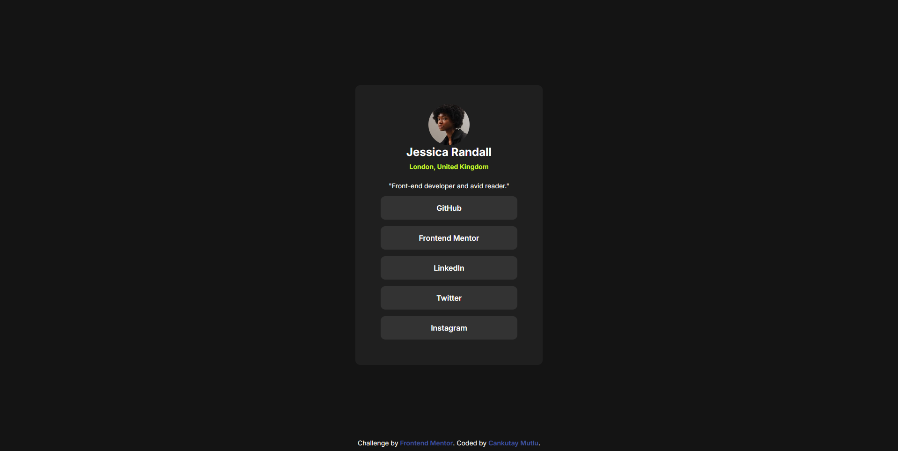

# Social Links Profile Solution - Frontend Mentor

## Table of contents

- [Overview](#overview)
    - [The challenge](#the-challenge)
    - [Screenshot](#screenshot)
    - [Links](#links)
- [My process](#my-process)
    - [Built with](#built-with)
    - [What I learned](#what-i-learned)
- [Author](#author)

### Overview

This is a solution to the [Social links profile challenge on Frontend Mentor](https://www.frontendmentor.io/challenges/social-links-profile-UG32l9m6dQ).

### The challenge

Users should be able to:

- See hover and focus states for all interactive elements on the page

### Screenshot

### Links

- Solution URL: (https://www.frontendmentor.io/solutions/social-links-profile-VXptyyw73l)
- Live Site URL: (https://caku2104.github.io/social-links-profile/)

## My process

### Built with

- Semantic HTML5 markup
- CSS custom properties
- CSS Flexbox
- Google Fonts

### What I learned

- How to center elements both horizontally and vertically using Flexbox.
- The importance of using `box-sizing: border-box` for predictable layouts.
- How `display: flex` changes the behavior of anchor elements.
- How to structure a clean and minimal CSS reset.

## Author

- GitHub – [(https://github.com/Caku2104)]
- Frontend Mentor – [(https://www.frontendmentor.io/profile/Caku2104)]
